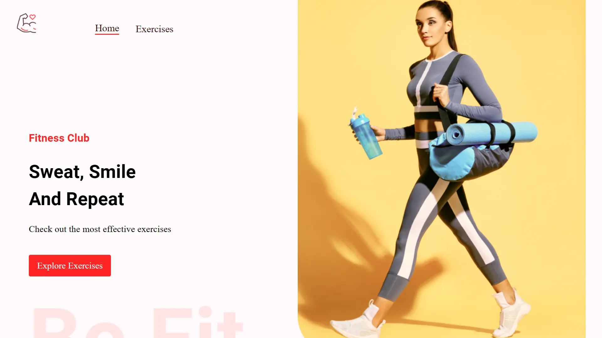

<div align="center">
    <a href="https://workout-app-fv.netlify.app" target="_blank">
      
    </a>
  <h3 align="center">Workout Exercises</h3>
</div>

##  <br /> 📋 <a name="table">Table of Contents</a>

- ✨ [Introduction](#introduction)
- ⚙️ [Tech Stack](#tech-stack)
- 📝 [Features](#features)
- 🚀 [Quick Start](#quick-start)

##  <br /> <a name="introduction">✨ Introduction</a>

**[EN]** Fitness application built on React.js that offers a comprehensive suite of features to enhance your workout experience. With the functionality to choose exercise categories and specific muscle groups, users can browse through a library of over one thousand exercises, each accompanied by practical examples. The application supports pagination for easy navigation and provides detailed information for each exercise.

**[FR]** Application de fitness construite avec React.js qui offre une suite complète de fonctionnalités pour améliorer votre expérience d'entraînement. Grâce à la possibilité de choisir des catégories d'exercices et des groupes musculaires spécifiques, les utilisateurs peuvent parcourir une bibliothèque de plus de mille exercices, chacun accompagné d'exemples pratiques. L'application prend en charge la pagination pour une navigation facile et fournit des informations détaillées pour chaque exercice.

##  <br /> <a name="tech-stack">⚙️ Tech Stack</a>

- **React** is a popular JavaScript library for building user interfaces, particularly single-page applications where data changes over time. React's component-based architecture allows developers to create reusable UI components, making development more efficient and the codebase easier to maintain. 

- **RapidAPI** is a leading platform for discovering and connecting to APIs. It allows developers to seamlessly integrate a wide range of APIs into their applications, providing access to data and services from multiple sources. With RapidAPI, developers can easily manage API subscriptions, monitor usage, and ensure efficient data fetching, which is essential for creating feature-rich applications.

- **Material UI** is a popular React component library that implements Google's Material Design guidelines. It offers a comprehensive suite of pre-designed, customizable components that help developers build beautiful and consistent user interfaces quickly. Material UI's extensive theming capabilities and responsive design ensure a seamless user experience across different devices and screen sizes.


## <br/> <a name="features">📝 Features</a>

👉 Advanced React Best Practices such as file structure and hooks.

👉 Creating a Beautiful User Interface using the Material UI (version 5).

👉 Fetching data from unlimited sources using RapidAPI.


## <br /> <a name="quick-start">🚀 Quick Start</a>

Follow these steps to set up the project locally on your machine.

<br/>**Prerequisites**

Make sure you have the following installed on your machine:

- [Git](https://git-scm.com/)
- [Node.js](https://nodejs.org/en)
- [npm](https://www.npmjs.com/) (Node Package Manager)

<br/>**Cloning the Repository**

```bash
git clone {git remote URL}
```

<br/>**Installation**

Let's install the project dependencies, from your terminal, run:

```bash
npm install
# or
yarn install
```

<br/>**Set Up Environment Variables**

Create a new file named `.env` in the root of your project and add the following content:

```env
# Rapid API
REACT_APP_RAPID_API_KEY=3619379170msh13ce30272bef263p12fe1fjsn3c430505bdab
```

Replace the placeholder values with your actual respective account credentials:

- [Rapid API](https://rapidapi.com/hub)
- [ExerciseDB](https://rapidapi.com/justin-WFnsXH_t6/api/exercisedb)
- [Youtube Search](https://rapidapi.com/h0p3rwe/api/youtube-search-and-download)


<br/>**Running the Project**

Installation will take a minute or two, but once that's done, you should be able to run the following command:

```bash
npm start
# or
yarn start
```

Open [`http://localhost:3000`](http://localhost:3000) in your browser to view the project.